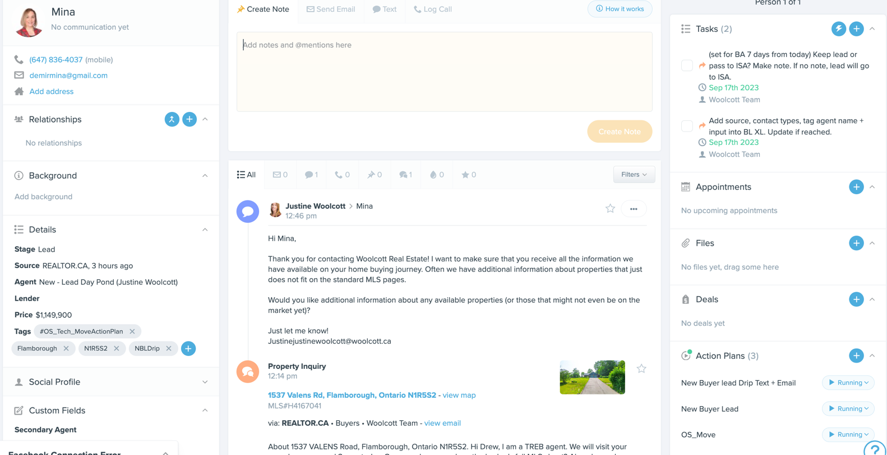
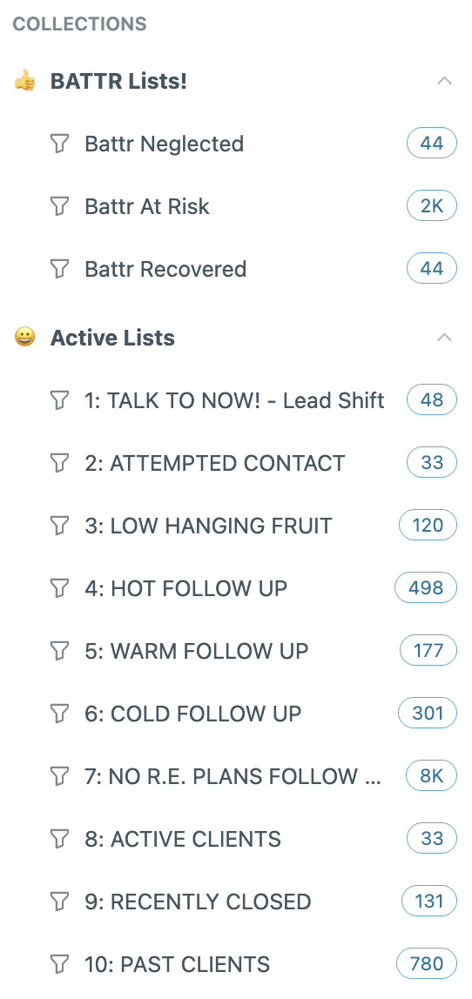
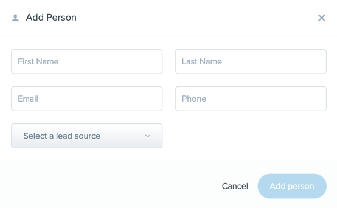
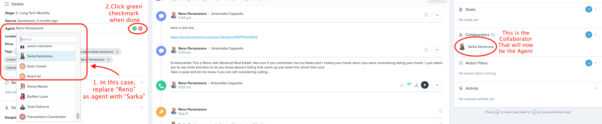
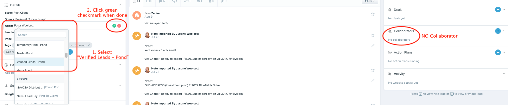
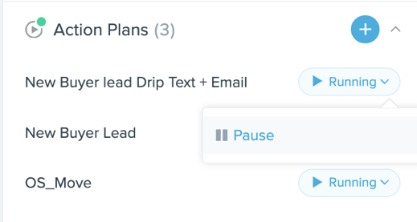

# Woolcott Real Estate - Team Handbook

Last Updated: April 27, 2026

## Email Protocol

All real estate related correspondence must be done using your **woolcott.ca** email address so that these email records survive personal email and server changes.

- Do not delete any correspondences with clients from your deleted files (results in permanent deletion).
- Use email as much as possible as an archive for documenting clients' directions and their knowledge of facets of the offer and/or properties at and around the time of an offer.

## Lead Definitions and Entitlement

> **Pilot Policy - Effective April 27, 2026. Review: July 27, 2026.**
> This section replaces the prior Three Week Rule and Vendor/Buyer Lead definitions for the duration of the pilot.

### Buyer Leads

Buyer agents receive new buyer leads directly from the team during their duty shifts.

If a buyer agent converts a team-provided buyer lead into a listing opportunity, the following applies:

- They must bring on a listing agent, **unless** they are Listing Certified or the client has been in their personal database for 3 months or more.
- If the client has been in the agent's database for at least 3 months and the agent personally generated the listing opportunity, they may take the listing without bringing on a listing agent.
- If the client is in the agent's database but comes in as a new listing lead through the team, the agent may work the listing with a listing agent for a referral fee as outlined below.

**Referral structure (non-Listing-Certified buyer agents converting to a listing):**

- 25% referral if the property is under $1,500,000
- 35% referral if the property is $1,500,000 or above
- Based on sale price
- Referrals are paid on the commensurate commission split (i.e., the referring agent's portion of the listing-side commission)

The buyer agent chooses which listing agent to work with.

**Listing Certified agents** pay no referral on converted listings, regardless of price point. If the property is over $1,500,000, the agent must consult with management before the appointment, and is strongly advised to bring another agent to assist.

### Listing Leads

Listing agents receive new listing leads directly from the team during their duty shifts.

Listing agents may work with any buyer leads they convert from their listings, or refer those buyer leads to another agent of their choice for a 25% referral fee, paid on the commensurate commission split.

### Mixed-Intent Leads (Buy + Sell at Initial Contact)

If a lead's initial inquiry indicates both buying and selling intent, both agents are assigned. **The Listing Agent contacts the lead first** in all mixed-intent cases.

- **Selling first:** Listing Agent is the main agent; Buyer Agent is collaborator.
- **Buying first:** Buyer Agent is the main agent; Listing Agent is collaborator.

In both configurations, the Listing Agent makes initial contact.

### Reclassification on First Contact

If a lead comes in presenting as one type but turns out on first contact to be the other, the lead goes to the **on-duty agent of the correct type at the time the lead originally came in**:

- Presents as buyer, turns out to be a listing → Listing Agent on duty when the lead came in.
- Presents as listing, turns out to be a buyer → Buyer Agent on duty when the lead came in.

### Becoming Listing Certified

To qualify, an agent must:

- Have a minimum of 6 months with the team
- Have completed at least 3 listings with the team
- Maintain an 80% listing close rate (of all listing appointments the agent attends, 80% result in a signed listing)
- Present their listing presentation to Peter, Drew, or Justine for approval

Once Listing Certified, an agent handles their own converted listings without bringing on a listing agent or paying any referral, regardless of value.

### Maintaining Listing Certified Status

Certification is evaluated on a rolling 6-month basis. An agent who drops below the 80% close rate loses Listing Certified status and must bring their close rate back above 80% to be recertified.

### Scope

This policy applies only to **team-provided leads**. It does not apply to an agent's personal leads, referrals, open house leads, or pond leads - unless the agent requests a listing agent's assistance.

### The 24 Hour Rule

If a lead is claimed from the New Lead Day Pond and there is no attempted call for more than 24 hours, the lead goes back into the New Lead Day Pond. All leads in the New Lead Day Pond are open to any agent to call (listing agents can call buyer leads and vice versa) once 24 consecutive hours have elapsed without a call attempt by the appropriate agent.

### No Two-Way Communication Prospecting Rule

If a lead has had no two-way conversation with the assigned agent in **12 months or more**, the assigned agent has no claim to that lead if another agent meets them in the field or prospects them. Two-way conversation includes the client responding to a text or email, or any documented phone conversation in FUB.

*Example: An agent door-knocks and starts a relationship with a seller, then discovers the seller is in the database under another agent. If there has been no two-way conversation for 12+ months, the door-knocking agent keeps the lead.*

### New Agent Rule

Agents with less than 8 months of experience must have a listing agent (or Drew, Jayne, or Peter) accompany them on all listing appointments other than personal leads, for the first two addresses. The new agent may pay the listing agent a portion of their commission, agreed in advance. Applies to agents joining after May 12, 2022.

### Manual Lead Entry - Administrator Notification

Any agent entering a lead into FUB manually must notify an administrator so the entry can be checked for duplicates and data accuracy. Email drewandjayne@woolcott.ca whenever a lead is entered manually.

## Commission Splits

### Incoming Vendor Leads (I)

**Split: 55/45 in favour of Woolcott Real Estate** (unless otherwise set out herein). Double-ended listing sales split 55/45 in favour of Woolcott.

1. Sent to Listing Agent on duty shift (except ISA generated leads and listing appointments booked directly by admin).

>i **Escalation:** If the following is true, set a listing appointment and forward to Drew/Jayne as we may determine that assistance is required: over 5 acres, commercial, vacant land, value likely over $1.7 million.

### Incoming Buyer Leads (II)

**Split: 50/50 on all buyer deals.** Double-ended buyer deals split 50/50.

1. By Buyer Agent duty shift (except ISA generated leads and pre-construction leads).
2. At the earliest possible opportunity, the lead should be offered a CMA if they have a house to sell in our market area. If the buyer lead has a home to sell and doesn't have a Listing Agent attached, send to listings@woolcott.ca to start a listing file.

### Open House, Personal Leads, Referrals (III)

**Open House Leads:** Split 50/50 for buyer deals and 55/45 for vendor leads. The generating sales representative works with the buying and/or selling lead. Open House leads are manually entered into FUB at the earliest practicable opportunity to prevent duplicate leads. The agent must notify an administrator (drewandjayne@woolcott.ca) when a lead is entered so it can be checked. If a lead visits multiple open houses in one day, the agent who enters the lead first into FUB owns the lead.

**Personal Leads** (friends, family, referrals from friends/family, clients that are personal leads): Split 50/50 on buyer deals and 55/45 on vendor deals. The generating sales rep works the buyer or selling lead. Personal Leads are never reallocated.

**Referrals** (from past clients or friends/family): Split 50/50 on buyer leads and 55/45 on vendor deals. The generating sales rep works with the lead. Referrals are active/hot leads (e.g., my brother wants to sell, my half-sister wants to buy). Referral leads are never reallocated, unless it's Drew's/Jayne's client referral that they opted to give to a team member.

**Referrals (to non-team agents):** Split 50/50 between the referring agent and the house.

### Cold Calls and Door-Knocking (IV)

**Split: 50/50 for buyer deals and 55/45 for vendor deals.** The generating sales rep works with the lead. Door knock leads are manually entered into FUB at the earliest practicable opportunity. The agent must notify an administrator (drewandjayne@woolcott.ca) when entering a lead so it can be tracked and checked.

When moving a cold call lead from your Cold Call List to your database, follow the Cold Call System. Cold Calls and Door Knocks can be reallocated if the generating agent is delinquent in their calls (prevents "stamping" leads or claiming streets). When calls are delinquent, administrators cannot distribute a new cold call list to an agent with past due warm calls.

> **Who Gets Added to FUB from Cold Calls/Door Knocks:** LEADS get entered - not simply people whose phone number or address we happen to have. If leads are spoken with, agree to be communicated with in the future AND you have taken down their first name, then they can be entered into the database. It is not fair to grab swaths of uncontacted names and claim them.

### Private/FSBOs (V)

**Split: 55/45 on vendor deals and 50/50 on buyer deals.** Any sales rep on the team can chase a private in any area. The usual database ownership rules apply. Leads should be sent to listings@woolcott.ca as soon as possible. If the prospect sells and purchases, the sales rep that listed the private can work with them on the buyer as well. Chasing privates is treated the same as Open House leads - agent generated, and the agent can opt to work both ends.

### Exclusive Listings (VI)

Exclusive listings are handled with the following requirements:

- Holdover must be 180 days.
- **Listing paperwork must be signed before any showing.** It is the agent's responsibility to protect their commission - no exclusive listing is to be shown without a signed listing agreement in place.
- If an agent wishes to show an exclusive listing to their buyers, a Buyer Representation Agreement must be in place to protect the buyer-side commission.
- Commission split equally between Listing Agent and Buyer Agent when double-ended.
- Since exclusive listings are typically offered at reduced commission, any commission reduction is shared between sides. Example: 3% total = 1.5% listing side / 1.5% buying side.
- Listing side split remains 55/45 in favour of Woolcott; buyer side remains 50/50.
- If a non-Woolcott agent brings an offer on an exclusive listing, the Listing Agent has full discretion over what, if anything, to pay the buying agent.

### Double Ends and If Buys (X)

**Double Ends - No Commission Concession:** Buying agent paid as per MLS, listing agent paid as per listing agreement. Buying end split 50/50; Listing end split 55/45 in favour of the company.

**Double Ends - Woolcott Commission Concession:** If there is a commission concession on a double end, it is subtracted equally from the buying and listing end (e.g., 0.5% concession = 0.25% reduced from each side). Buying end split 50/50; Listing end split 55/45 in favour of the company.

**If Buys:**
- Listing commission is reduced for an 'if buy': half of the reduction is remitted back to the Listing Agent from the purchase trade record.
- Applies only when the stated commission to the Buying Agent on the listing that the seller purchases is 2% or greater.
- The Buyer Agent commission can be reduced by up to 0.5% under this mechanism, but not more.
- If the Buying end is less than the Listing end, the Buying Agent commission will only be reduced proportionately.
- The Buyer Agent must be notified at the time the listing is signed or when the Buyer Agent commences working with the Buyer, whichever comes first.
- The Listing Agent can opt out and absorb the total reduction.
- The Buyer Agent can opt to pass on the Buyer.

### High Performance Agent Program

> All commissions split **65% to the agent and 35% to Woolcott Real Estate** on every transaction after the agent has achieved **$250,000 in personal commissions earned** in a calendar year. The 65/35 split only applies to deals written after the threshold is achieved. ISA fees and other referral fees still apply.

## Duty Shifts and Response Requirements

### Claiming Leads on Duty

A lead comes in through FUB during an agent's duty shift. The on-duty agent has an **obligation to contact the lead**, but has the option to either claim it and continue working it, or contact it once and leave it in the New Lead Day Pond for another agent to pick up.

- **Buyer leads** go to the Buyer Agent on duty.
- **Listing leads** go to the Listing Agent on duty.
- A collaborator is **not** assigned to single-side leads.
- For **mixed-intent leads** only (buy + sell at initial inquiry), both a Buyer Agent and Listing Agent are assigned per the Mixed-Intent Leads rule in the Lead Definitions section.

If the on-duty agent does not want to work a lead (e.g., the lead is out of area), they must still make initial contact with the lead during their shift, and may then assign the lead to another agent on the team afterward.

### In-Office Duty Shifts

Monday through Friday, 9am to 5pm. During previews, calls will be sent to on-duty agents attending previews. All other shifts can be manned out of office, but the on-duty agent must be available to respond. Agents cannot book showings or listing appointments during a duty shift.

### After-Hours Shifts

- An auto email is sent to the on-duty agent at the beginning of their shift to confirm availability.
- If the agent does not respond within 15 minutes, the remainder of their shift goes to another agent.
- If a call-in lead comes in after hours or a lead doesn't auto-populate into FUB (Open House, Door Knock, etc.), the lead must be manually added. See the Manually Adding a Lead section.
- Response times are monitored. If a lead is not claimed within 15 minutes, it will be reallocated.
- Response times have more flexibility between 9:00pm and 9am. All overnight leads must be responded to by 9:30am the following day.

> **IMPORTANT - Overnight Leads:** Agents must claim any overnight leads they wish to keep **before 9:00am**. The pond rotates at 9am and any unclaimed overnight leads will become accessible to other agents at that time, meaning the original on-duty agent will lose access.

>! **WARNING:** If the response time on any after-hours lead exceeds 15 minutes, the agent may forfeit subsequent lead opportunities including the following week's shifts. If an agent fails to acknowledge a shift test email within 15 minutes, that shift is forfeited and the agent may forfeit subsequent lead opportunities.

### Points of Note

- Do not check if a lead is already in the database prior to contacting the lead. Speed is paramount - the time delay from searching the database costs leads.
- At the earliest opportunity, administrators will check the lead contact details to ensure it is not already entered.
- If the lead is in the database, administrators will let Peter know immediately.

## Lead Protection

### Database Lead Protection (VII)

All leads are protected in the database. If an agent is the Buyer Agent or the Listing Agent on a lead, they have the exclusive right to work with that lead.

- **Agents Meeting New Contacts Incidentally:** Check the database to ensure the contact is not already under another agent. Further ask an administrator to fully check the database if there is any doubt.
- **Leads of Agents New to the Team:** A new agent's list of personal contacts and clients must be emailed to drewandjayne@woolcott.ca when they join the team. Administrators enter these leads into the database. If a lead is already in the database under another agent, both agents should attempt to resolve ownership; if no easy resolution, both agents and Drew or Peter will meet to resolve.
- **Referrals:** If an agent is directly referred to a contact already in the database and the client wishes to work with the referred agent, those wishes must be respected. If the original owner has done substantial work, some compensation may be in order.

### The 80/20 Rule

In the rare case that the client will not use a BA or LA assigned (in spite of best efforts to promote this):

1. The LA/BA must inform the assigned BA/LA in person or by phone as soon as they are aware and explain the reasoning.
2. LA, BA and management will review and attempt to reach an agreeable conclusion. If not possible, management will resolve unilaterally.

>! **80/20 Penalty:** If an agent works with a lead already assigned in the database without properly checking, **80% of the agent's commission is paid to the agent assigned to the lead in the Database.**

> **The client always has the absolute right to pick whichever agent they wish to work with.** All reasonable efforts must be taken to have the client work with the appropriate agent per the rules above before this happens.

## Reallocation of Leads (VIII)

If a lead falls out of compliance with the contact schedule and is not followed up according to the plan, it can and will be reassigned away from the agent to wherever the company sees fit - another agent of the appropriate type, an ISA, or back to the pond.

**Leads exempt from reallocation:**

- Personal leads
- Past client leads
- Referrals
- Leads the agent has met with face to face in the past (at the company's discretion)

**Five-Reallocation Rule:** If any agent has more than 5 reassigned leads in a single week, they will be pulled off duty shifts the following week to give them a chance to catch up on their database.

If an ISA picks up a reallocated lead and converts it, ISA fees apply per the ISA Rules section. The lead will be assigned to a different agent than the original (delinquent) owner.

## ISA Rules (IX)

### ISA Compensation - Updated April 27, 2026

#### Listing Appointments

When Isabella books a listing appointment, the opportunity is sent to a listing agent for approval before being assigned. If the agent declines, Isabella moves on to the next agent.

A flat **$300 appointment fee** applies once the appointment is met. The fee is split evenly - **$150 paid by Woolcott**, **$150 deducted from the agent** who attends the appointment. **The fee is only paid if the appointment actually takes place.** It is earned regardless of whether the listing is signed.

#### Distribution

Isabella distributes appointments via a **round-robin system** among Listing Agents. **Exception:** If a lead is out of area, Isabella shotgun-distributes the opportunity to all Listing Agents and the first to respond takes it.

#### Buyer Opportunities

Isabella is bonused on buyer showings and in-person buyer appointments she sets up. A flat **$300 fee** applies per appointment met - split evenly, with **$150 paid by Woolcott** and **$150 paid by the Buyer Agent** who attends. The fee is only paid if the appointment actually takes place.

Distribution of buyer opportunities is at Isabella's discretion among Buyer Agents. Standard buyer-side commission splits apply.

#### List + Buy Combo

When Isabella books a combo list/buy opportunity, she will make every effort to serve the listing side to a Listing Agent and the buy side to a Buyer Agent. If the client insists on one agent, Isabella has discretion over which agent receives it. The $300 listing appointment fee applies to the listing side, and the $300 buyer appointment fee applies to the buy side, per the rules above.

### ISA System

The company has enlisted an Inside Sales Associate to nurture leads from various sources. Leads are distributed to outside sales agents at the discretion of the company. A tally system ensures leads are distributed more or less evenly. This is available for agents to review.

### ISA Calling Through Listing Agent Warm Calls (from May 2022)

Certain listing agents may agree to have ISAs contact their clients for CMAs. In cases where a walk-through is booked, the agent pays the ISA $100 per address directly. If that client then lists within 6 months and the home sells, the listing appointment fee applies (less the $100 original fee) of the agent's commission.

## FUB (Follow Up Boss) - How To and SOPs

### Golden Rules

- Agents must create a task for Transactions Coordinator to change phone number, email, address, relationships, names.
- Stages must be up to date at all times.
- Agents cannot add any new contact info as admin team needs to check for dupes. This means a spouse, a new phone number, email address, address. Must tag @Transactions Coordinator to add.

### Agent Daily Workflow

1. Contact all new leads first — **1: TALK TO NOW!** Smart List
2. Then contact the **2: ATTEMPTED CONTACT** Smart List
3. Check your Inbox for inbound text messages and missed calls
4. Open your Tasks to see if anything pressing
5. Then contact the remaining Smart Lists **3-10**

### Things to Remember

> **IF IT DIDN'T HAPPEN IN FOLLOW UP BOSS, IT DIDN'T HAPPEN.**

- ALWAYS use the FUB Dialer to log all calls and texts automatically.
- ALWAYS make appropriate Stage changes based on conversations or reach-out attempts to keep your Smart Lists, Action Plans, and follow-up procedures accurate.
- If lead asks for no more email, @Woolcott Team to unsubscribe.
- Keep Tasks to a minimum unless it is a specific date/time to avoid Overdue and overwhelming Tasks.
- Use Background for high-level information since it is easy to check at a glance when you send or receive additional info about a contact such as price, area, zoning, and other pertinent information.
- You can move the FUB widgets around in your own account - it will only edit your view.

### Follow Up Stages, Smart Lists, and Cadence

| Stage | Who Is In Here | Smart List | Cadence | Nudged | Swept |
|-------|---------------|------------|---------|--------|-------|
| Lead | All new people coming into FUB | 1: TALK TO NOW! | - | - | - |
| Attempted Contact | Leads you claimed but not connected with | 2: ATTEMPTED CONTACT | 24 hours | - | Hour 36 |
| A - Ready Now | Lead ready to transact now, contact weekly | 4: HOT FOLLOW UP | 7 days | Day 8 | Day 10 |
| B - 2-6 Months Out | Lead 2-6 months out, contact every two weeks | 5: WARM FOLLOW UP | 14 days | Day 15 | Day 18 |
| C - 6+ Months Out | Lead 6+ months out, contact monthly | 6: COLD FOLLOW UP | 30 days | Day 33 | Day 45 |
| No Concrete R.E. Plans | No timeline, contact every 30 days + nurture action plans | 7: NO R.E. PLANS FOLLOW UP | 90 days | TBD | Day 120 |
| Seller Active / Buyer Active | Client under agreement or committed to transacting (tag Seller or Buyer) | 8: ACTIVE CLIENTS | 7 days | Day 13 | Not Swept |
| Firm Deal | Client under contract | N/A | N/A | N/A | Not Swept |
| Closed | Client has closed in the past 3 months | 9: RECENTLY CLOSED | 30 days | Day 33 | Not Swept |
| Past Client | Clients 3+ months post closing | 10: PAST CLIENTS | 90 days | Day 95 | Not Swept |
| Cold - Email Only | Email address only or client requested no more phone calls; must have valid email | N/A | N/A | N/A | N/A |
| Non-Client | Not likely to transact but info is valuable (vendors, investors, builders, lawyers, inspectors, etc.) | N/A | N/A | N/A | N/A |
| Trash | People who have died, not real people, or sworn at a Woolcott team member | N/A | N/A | N/A | N/A |

### Smart Lists Not Tied to Stages

| Smart List | Definition | Notes |
|-----------|-----------|-------|
| 3: LOW HANGING FRUIT | All leads in your name, not in a transaction stage, active in last 3 days, no communication in last 6+ hours | This is a hot list. Call and clear every single day. |
| Birthday List / Partner Birthday List | Any contact assigned to you with a birthday in the next 14 days | - |
| Working | All clients you are actively working or trying to convert | Max 25 people. Add by tagging 'Working' on their profile. |

### Database Rules (XII)

All conversations with clients are to be summarized in FUB within 2 business days.

>! **The following are grounds for dismissal:** (1) Deleting any tasks (mark it done or enter a note). (2) Marking tasks done without doing them or entering a note. (3) Deleting any notes in the database. (4) Adding or changing contact information (ask Admin). (5) Deleting any contacts (stage as Trash or ask Admin). (6) Marking another team member's task done. (7) Removing an agent from a lead. **Administration is not at liberty to override anything set out above.**

### Manually Adding a Lead

The majority of leads will be added into Follow Up Boss automatically or by admin. The only leads that an agent can enter manually are: Open House, Door Knock or After Hours/Answering Service leads.

During business hours (9am to 7pm daily) please send leads to drewandjayne@woolcott.ca to enter for you. The operations team checks for duplicates and ensure data is entered correctly.

**If you do enter your own lead:** you must email drewandjayne@woolcott.ca that you have entered the lead so admin can scrub and ensure it is entered correctly.

1. Log into Follow Up Boss on your desktop.
2. In the upper-right hand corner, click the blue Add Person icon.

3. Add the contact's First Name, Last Name, Email, Phone Number and Lead Source.

4. Select Add Person. If you receive the message "Contact Already Exists", this means the contact already exists and is assigned to another team member. Please email drewandjayne@woolcott.ca. Do not click Add Duplicate.
5. If no duplicate, the contact record will open up automatically. Enter a note stating where lead is from, any address information or additional notes for admin.

### Reallocating Leads in FUB

You do not have to work any leads that you don't want to. But, you must give them back to the company if you elect not to move forward with them so someone else can try. When reallocating leads, rather than changing the **stage**, we change the **agent**. This way we retain the calling cadence which gives useful info to the next agent. When reallocating leads, it's imperative to make a note as you will lose access to the lead directly after.

**For reallocating leads where there are two agents:**

*If you are the collaborator on the lead:*
1. You can remove yourself from the lead at any time.
2. Make a note that you are removing yourself and the reason.
3. Scroll to the Collaborator section on bottom right, click the Trash Can icon beside your name.

*If you are the main agent on the lead:*
1. You must give the other agent on the file the opportunity to take over the lead.
2. Make a note for why you are reallocating. Be sure to @ the agent so they get a notification.
3. Replace your name in the “Agent” field with the collaborator’s name.
4. Click green checkmark to remove yourself.

**For reallocating leads where there is no collaborator:**
1. Make a note for why you are reallocating.
2. Replace your name in the "Agent" field with either Verified - Pond, Verified Homeowners - POND, or Fishing Pond.
3. Click green checkmark.

### Reallocation Cheat Sheet

| Action | What Happens | End Location | When to Use |
|--------|-------------|-------------|-------------|
| Assign Collaborator as main agent | Removes you, assigns collab as both listing + buying agent | Assigned in full to the collab agent | At your discretion |
| Verified Leads - Pond | You are no longer the assigned agent | Verified Leads - POND. Any agent can 'Fish' for it and claim both ends | Leads that haven't said no or are more than 2 years out |
| Verified Homeowners - POND | You are no longer the assigned agent | Verified Homeowners - POND. Confirmed homeowners | Leads that haven't said no, 2+ years out, own a home |
| Fishing Pond | You are no longer the assigned agent | Fishing Pond. Unverified or unreachable leads | Leads we have not been able to reach or unsure if real |

### Automated Stage Transitions

| Stage | What Happens | End Location | When to Use |
|-------|-------------|-------------|-------------|
| Cold - Email Only | Automation removes you from the lead | Email Only - Pond (all agents have access, useful for marketing segmentation) | Leads without phone numbers, leads that only want emails, or asked to not be called (politely) |
| Lease | Automation removes you from the lead | Sent to a leasing agent | When it is a lease lead you no longer want to work |
| Trash | Removed from you, hidden from searches | Trash Pond | Upset people wanting no further communications. Basically deleting but keeping record. |

### Claiming a Verified Lead or Fishing Pond Lead

To locate the verified leads pond: Go to the "People" tab and click the "More" button beside your pinned lists. In the "More" list, look for "Verified Leads - POND." Sort by most recently added, source, stage, etc. (Past Client is a great one to look for.)

In order to claim a lead from the pond, you **must have had a substantial conversation** (appointment or search set up) and/or the client has agreed to a follow up.

1. Ensure that you click the “Log Call” under the contact so that it calls from your FUB number.
2. Click “Agent” and change it from “Verified Leads — Pond” to your name. Click the green check mark. A note will be made: “Claimed by {AGENT} from Verified Leads — Pond.”
3. Change the stage of this lead to match the follow up cadence that you would like.

[Watch Justine's Loom walkthrough →](https://www.loom.com/share/deeadeac1e134ca3b96ade8ee8ce3bc1)

## New Lead Contact Schedules

*Halt this process once client responds to any form of contact. Once you have a response, change stage from Lead to correct stage.*

### New Buyer Lead Contact Schedule

**Day 1 - INITIAL CONTACT:**
- If phone number, call client from FUB ASAP using FUB number (max within 15 minutes). *If before 9am, can wait until 9:30am to call.*
  - If client answers, change stage to appropriate one (Active, A, B, C, or No Concrete Plans).
- If no answer, call again from FUB or personal number after a minute or two and log call.
- Send Text 1 manually.
- VA will set up search automatically based on original property inquiry.
- Send custom email addressing query.

**Day 2:** Call from FUB. If no answer, call again after a minute or two. Send "New Buyer Lead - Day 2" text template. Drip email will automatically go out.

**Day 3:** Call from FUB. If no answer, call again. Send "New Buyer Lead - Day 3" text template. Drip email auto.

**Day 4:** Call from FUB. If no answer, call again. Send "New Buyer Lead - Day 4" text template. Drip email auto.

**Day 5:** Call from FUB. If no answer, call again. Send "New Buyer Lead - Day 5" text template. Drip email auto.

**Day 6:** Call from FUB. If no answer, call again. Send email and text manually.

**Day 7:** Call from FUB. If no answer, call again. Send email and text manually.

**Day 10:** If the lead is not reached, the lead will automatically be reassigned to an ISA who will work the lead.

### New Listing Lead Contact Schedule

**During all shifts 10am-7pm:** Admins will add all leads in for you into FUB and assign the correct agent as the collab. You will get an email - click on the link and follow the contact schedule below.

**During all shifts 7pm-10am:**
- **If lead automatically pulls into FUB:** Click notification or link. If buyer lead - ignore and B-agent will add you on as collab. If Listing lead - claim by adding yourself as the assigned "agent."
- **If lead does not automatically pull into FUB** (call-in, RealIntro, etc): Manually enter. See Manually Adding a Lead above.

**Day 1 - INITIAL CONTACT:**
- If phone number, call client from FUB ASAP using FUB number (max within 15 minutes).
  - If client answers, change stage appropriately.
- Send custom text addressing their query.
- Send custom email addressing query.
- If no answer, call again from FUB or personal number after a minute or two and log call.

**Day 2-6:** Call from FUB. If no answer, call again. Drip Listing Text and email will automatically go out.

**Day 7:** Call from FUB. If no answer, call again. Send email and text manually.

**Day 8 - if still no contact:** Either keep the lead (change to Attempted Contact, call/text/email daily) OR send to ISA. **It will not go back to you when appointment is generated.**

**Day 9:** You will be tagged in a note: "Please make sure to move this lead into an appropriate nurture stage. If you do not, this lead will be taken."

**Day 10:** If the stage is not changed from Lead, the lead will automatically be reassigned to an ISA.

## Appointments, Searches, and Drip Campaigns

### Setting Appointments in FUB

[Watch the Loom →](https://www.loom.com/share/e1373cb9a7f84c8a8e4cf477dc601d1d)

There is an automation in place for RECO Compliance: The automation will automatically send a RECO guide out to clients when the "First Buyer Outing" appointment is set in FUB. This shows in FUB that the link was sent, opened, and clicked - super compliant!

- The 1⁄2 Listing Appointments are automatically set by our listing coordinators on your behalf.
- Buyer showings are added in by the agent - just click First Buyer Outing as the Appointment Type.
- If there is no email address, the automation will not run.

### Setting Up a Sierra Search

[Watch the Loom →](https://www.loom.com/share/980b62b500d748268ee681469ba83560)

1. Access Sierra: Log in to Sierra and navigate to the client's profile.
2. Validate Email: Verify the lead's email address has a green checkmark. If red X, change to "valid email."
3. Add Partner's Email: If applicable, manually add the partner's email. Check "CC secondary email on listing alerts."
4. Set Up Search: Click "Search" tab → "Create New" → choose RAHB or TREB.
5. Customize: Enter a descriptive name (e.g., "Best New Listings in Waterdown"). Set frequency to "as soon as new listings are added." Customize subject line (e.g., [CLIENT NAME's] Latest Waterdown Listings).
6. Define Property Criteria: Use the map option and draw a geographical area. Set price range and other criteria.
7. Save Search.
8. Send Introduction Email: Select "send all matching listings."
9. Verify: Confirm search is saved and introduction email is sent successfully.

### Pausing Drip Action Plans

A drip campaign automatically pauses when:
- Contact or relationship replies to you via email.
- Contact or relationship replies to your FUB number by text.
- A phone call on your FUB number lasts more than 2.5 minutes (does not include short calls, voicemails, or manually logged calls).

To manually pause: Navigate to the contact record → Action Plan section at bottom right → find the plan name → click arrow beside “Running” → click Pause.

### Questions to Keep People on the Phone

[Reference document with conversation questions →](https://docs.google.com/document/d/1rWvWAQ-JcUxrSBOlK6BgXtkNt_E8aEYAWFxoMvYiLwg/edit)

## Duplicate Leads (XI)

Although every effort will be made to avoid duplication, duplicates may exist due to leads using different phone numbers, email addresses, or spouse's names. If a duplicate is discovered, agents should try to work it out among themselves. Failing that, both parties meet with Management to reach a resolution. Failing that, Management will resolve unilaterally.

## Listing Agent Responsibilities (XIV)

- All required data fields on the listing must be completed - it is not Admin's job.
- If submitted after 3pm, Admin may not process that day (after 2pm on a Friday = next business day).
- **Commission Shortfalls:** All listings that go live must have a parcel register pulled before Woolcott incurs any expenses (media, staging, etc). Cost split 50/50 with Woolcott and the listing agent. The listing agent is personally responsible for any buyer commissions owed if there are not enough funds on closing day. If proper due diligence was completed and the seller subsequently defaults, the shortfall will be split evenly.
- Complete the comments in full (including client comments) - Admin has not been in the home.
- If the property qualifies for staging, complete the staging request template and send to Justine and Sue.
- **Photography:** Complete the photo request template and email to Justine. Photos have 24-hour turnaround (not same day). Best practice is 48 hours from photos for listing live date.
- **Weekly Vendor Calls:** Must talk to each Vendor every week at a minimum (calls, texts, emails). A common complaint from sellers is that their agent never talks to them.

## Staging Program (XV)

- No staging for listings with less than 90 days term or if the commission to us is less than $10,000. If commission is under $10,000, the agent requests staging, and the listing does not sell (cancels or expires), the agent will reimburse 50% of staging costs up to $250.
- As of July 2025, all listings with staging are subject to a **$2,000 cancellation fee** if cancelled or suspended prior to the expiry date. This is in the Schedule A for all listing agreements.
  - If an agent procures their own paperwork and omits this clause, or if it is removed without consent of Justine or Jayne (must be documented in FUB), the listing agent is liable for this cost.

>i **Buyer Agents** must consult with Jayne (or Drew in her absence) prior to any listing appointment to maintain closing rate.

## Agent Mentorship Program (XVI)

### New Agent - No Experience

- First 2 weeks: work with Peter to complete onboarding training.
- Senior agent selected by Peter.
- Meet with Senior Agent weekly for progress, wins/losses, role playing, scripting, objection handling.
- Shadow the agent (duty shifts, showings, FUB, Open Houses, Buyer Presentations, Listing Presentations).
- Senior Agent available for last-minute questions and assistance with offers.
- Senior Agent gets a 10% referral (50% house; 40% Buyer Agent; 10% Mentor) on first 2 deals. If the Senior Agent is a Buyer Agent and one deal is a Listing, Senior Buyer Agent and Listing Agent split the 10% evenly.
- Minimum 3 months, can be extended with mutual agreement.

### New Agent - Experience

- First week or two: work with Peter to complete onboarding.
- Senior Agent selected by Peter.
- Shadow agent (duty shifts, showings, FUB, Open Houses, Buyer Presentations, Listing Presentations).
- Senior Agent available for last-minute questions and assistance with offers.
- Senior Agent gets a 10% referral of only the Agent's commission on first 2 deals.
- Minimum 3 months, can be extended with mutual agreement.

### Existing Agent Needing Assistance

- Agent can ask for help or be encouraged by Drew and Peter.
- Senior Agent selected by Peter.
- Senior Agent gets a 10% referral (50% house; 40% Buyer Agent; 10% Mentor) on first 2 deals.
- Minimum 3 months, can be extended with mutual agreement.

## Normal Trading Area

- **East:** as far as the Mississauga/Oakville border
- **North:** to the 401
- **South:** not beyond Brantford (rural Brantford is NOT included)
- **Towards Niagara:** Grimsby is the extent

## Team Preview Duties (XVII)

### Previews

- All Buyer Agents are to preview all required listings.
- Previews are held Wednesdays from 9:00am to 2:00pm only.
- If a Buyer Agent fails to preview on the designated day, they have 2 additional days. If 3 days pass without previewing, their Buyer Agent shifts will be reallocated until outstanding previews are completed.
- Listings added after the preview list is sent out are considered optional.
- If there are time constraints set by the seller in addition to the set timelines, the preview is deemed optional.
- Admin will block the first Wednesday 9am-2pm in BrokerBay for new listings that have not been previewed.
- **Deadline for preview feedback:** Thursday at noon.

### Open House Duties

- **Wednesday prior:** Bring 1 Open House sign to the property and place it on the lawn (except Oakville listings). **Do not contact the client directly until you have spoken with the Listing Agent for the property** to coordinate any messaging or property-specific notes. Then call the client to introduce yourself, ask about feature sheets, and learn anything special about the property.
- **Day of:** Drop off at least 3 additional signs. There is a list of recommended documents on the Open House wall in the Waterdown office.
- **Feedback:** Inform homeowners and include drewandjayne@woolcott.ca and the Listing Agent no later than 9am Monday following. Best practice is immediately after the Open House. Failure to do so may result in forfeiture of duty shifts for the following week.

### Out of Town Listings

- Buyer Agents will not be compelled to host Open Houses or preview listings outside the normal trading area.
- If an Open House is required outside the normal trading area, it is hosted by the Listing Agent or a volunteer.
- Buyer Agents can still take calls and set up showings on out-of-town listings.
- If the Buyer Agent does not want to show the property, they should circulate to all Buyer Agents. If no one accepts, let the Sales Manager know.

## Vacation Policy (XIII)

- You cannot be away and watch your business at the same time. Let someone handle business while you are away.
- **1 week or greater:** Let Management know via email and let us know who is watching. We will block both your calendar and the vacation calendar.
- **More than 2 weeks:** Chat with Management first for planning.
- No shifts for three days prior to being away for 5+ days.
- If not away on a Long Weekend or Christmas Holidays and do not want shifts, you must have someone cover you. No "here but not taking shifts."
- Most any one agent can cover is for two other agents.
- Listing Agents can only cover Listing Agents; Buyer Agents can only cover Buyer Agents.
- **Minimum:** 4 Listing Agents and 5 Buyer Agents stay.
- Agents must have an **out-of-office auto-reply** set on their email if they are out of town and unable to respond. It is recommended that agents forward their email to the covering agent for the duration of their absence.
